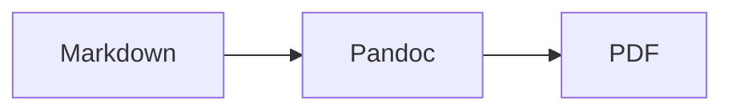

# Markdown-to-LaTeX book template

Maintain Markdown chapters under `notes/` and one `book.yml` config file.
Every push that touches them runs a GitHub Actions workflow that validates
the content, typesets it with Pandoc and XeLaTeX, and publishes two
artifacts: the finished **PDF** and a **self-contained LaTeX source `.zip`**
that reproduces it without this repository, Pandoc, Node, or Python.

Content is treated as untrusted: raw HTML and raw TeX in chapters are
rejected before the (comparatively slow) TeX build ever starts, and every
`book.yml` value that reaches the LaTeX template is either escaped plain
text or drawn from a strict schema allow-list.

## Who edits what

**Authors edit only `notes/**/*.md` and `book.yml`.** Images referenced by a
chapter belong in `notes/assets/`. Maintainers own `scripts/`, `filters/`,
`templates/`, `schema/`, and `.github/workflows/` — changes there alter the
build or its trust boundary and should get maintainer review.

## Repository layout

| Path | Purpose | Owner |
|---|---|---|
| `book.yml` | Title, author, chapter order, header/footer, typography, page layout | Authors |
| `notes/**/*.md` | Chapter source | Authors |
| `notes/assets/` | Checked-in image sources (SVG, PNG, JPG, PDF) | Authors |
| `schema/book.schema.json` | `book.yml`'s configuration contract | Maintainers |
| `scripts/` | Validation and the reproducible build pipeline | Maintainers |
| `filters/` | Pandoc Lua filters (table/landscape handling) | Maintainers |
| `templates/` | LaTeX template and package policy | Maintainers |
| `.github/workflows/` | CI: validate, build, package, publish | Maintainers |
| `build/`, `dist/` | Generated, gitignored output | Generated |

## Quick start

1. Edit `book.yml` — title, author, chapter list, header/footer text.
2. Add or edit chapters under `notes/`.
3. Push. The **Build book** workflow validates and renders automatically;
   download `book-pdf` and `latex-source` from the run's **Artifacts**.

## `book.yml`: the one config file

`book.yml` is the single place to set the book name, author, and running
header/footer, plus everything else about typography and page layout.
`schema/book.schema.json` is the definitive, enforced contract; unknown
fields or malformed values fail validation with a clear error instead of
silently doing nothing.

```yaml
title: The Small Systems Handbook
subtitle: A representative Markdown book
author: Example Author        # or a YAML list for multiple authors
language: en-US
date: "2026-09-16"

chapters:                     # sole source of publication order
  - notes/01-welcome.md
  - notes/02-layout-and-diagrams.md
  - notes/03-reference-tables.md

header_text: ""                # running header; falls back to `title`
footer_text: ""                # running footer, next to the page number

fonts: { main: TeX Gyre Pagella, sans: TeX Gyre Heros, mono: TeX Gyre Cursor, size: 11pt }
margins: { top: 25mm, right: 25mm, bottom: 25mm, left: 25mm }
link_colors: { link: blue, url: blue, cite: teal }
paper_size: a4
toc_depth: 2
table_of_contents: true
```

See `schema/book.schema.json` for the complete field list (cover image,
paper size, margins, fonts, link colors, document-class options, page
numbering, table/figure/list-of-contents toggles, bibliography).

## Authoring chapters

### Chapter names and order

Use lower-case, zero-padded numeric prefixes: `notes/01-getting-started.md`,
`notes/02-long-example.md`, or nested paths such as
`notes/03-api/01-overview.md`. The `chapters` array in `book.yml` is the sole
source of publication order; every Markdown file under `notes/` must appear
there exactly once. Each chapter needs non-comment text and exactly one
level-one (`#`) heading, which becomes its chapter title.

### Supported Markdown

Headings, emphasis, lists, block quotes, fenced code (with syntax
highlighting), pipe and grid tables, links, cross-chapter links, footnotes,
citations (if a bibliography is configured), images, Mermaid diagrams
(including chart types like `pie`), and LaTeX math (`$inline$` and
`$$display$$`, including `amsmath` environments like `aligned` and `cases`).
Internal links use a heading fragment (`[Tables](#tables)`) or a chapter path
plus fragment (`[diagrams](02-layout-and-diagrams.md#diagrams)`).

### Images

Keep image files under `notes/assets/` and reference them with a path
relative to the chapter:

```markdown
{#fig:pipeline width=80% align=left}
```

`width`, `height`, `align` (`left`, `center`, `right`), a caption, and a
label are all optional; figures default to centered, `keepaspectratio`, and
bounded to `\linewidth` by `0.85\textheight`. SVG, PNG, JPEG, and PDF are
accepted — SVGs are rasterized to vector PDF at build time (via
`rsvg-convert`), since XeLaTeX cannot embed SVG directly. Every image must
exist and every file under `notes/assets/` must be referenced by some
chapter; both are checked before the TeX build starts.

### Mermaid diagrams

Use a fenced block whose info string is `mermaid`, with the same
presentation attributes as images and an explicit `caption`:

````markdown

````

GitHub's own Markdown viewer renders this fence inline too. The build
renders it to a vector PDF with the pinned Mermaid CLI before Pandoc runs.
Figure identifiers (`#fig:...`) must be unique across the whole book,
whether attached to an image or a Mermaid block.

### Tables

Use pipe or grid tables. Pandoc emits LaTeX `longtable`, so a table may flow
onto later pages with its header row repeated automatically:

```markdown
| Name | Meaning |
|---|---|
| `id` | Stable identifier |

: Fields exported by the service. {#tbl:fields}
```

A Lua filter (`filters/longtable.lua`) normalizes explicit column widths and
tightens padding/font size once a table reaches six or more columns, without
wrapping it in an unbreakable resize box. For material wider than the page,
wrap it in a `{.landscape}` fenced div to rotate just that section:

```markdown
::: {.landscape}
| A very wide table... |
:::
```

## Validate and build locally

Install Python dependencies, Pandoc, XeLaTeX (TeX Live), and Node.js, then:

```sh
pip install -r requirements.txt
npm ci
make validate   # schema + content checks, fast, no TeX required
make            # writes build/book.pdf and build/book.tex
make test       # unit tests for the content-preparation pipeline
```

`make validate` runs `scripts/validate.py` (chapter/asset/link/footnote/
figure-label checks) and `scripts/build.py --validate-only` (schema check).
`make` runs `scripts/build-book.sh`, which validates, resolves images and
Mermaid diagrams into `build/assets/`, renders LaTeX with Pandoc, and
compiles it with `latexmk`. Delete `build/` and `dist/` for a clean rebuild.

### Docker

`docker build -t latex-book .` produces an image with every dependency
pinned; `docker run --rm -v "$PWD":/book latex-book` builds the same way CI
does, without installing anything locally.

## CI and artifacts

Every push and pull request that touches `notes/**`, `book.yml`, or the
build machinery itself runs two jobs:

1. **validate** — schema/content checks and unit tests; fails fast, before
   installing TeX Live.
2. **build** (after validate passes) — renders the PDF, verifies the output
   actually contains the expected content, and uploads two artifacts:
   - `book-pdf` — `build/book.pdf`.
   - `latex-source` — `dist/latex-source.zip`, containing `build/book.tex`
     plus every image and rendered diagram it references under
     `build/assets/`.

Open the workflow run in GitHub, scroll to **Artifacts**, and download
either. To reproduce the PDF from the source archive alone:

```sh
unzip latex-source.zip
latexmk -xelatex -interaction=nonstopmode -halt-on-error -output-directory=build build/book.tex
```

## Raw HTML and raw LaTeX trust model

Raw HTML and raw LaTeX in chapters are rejected by `scripts/validate.py`
(outside fenced code blocks, so teaching examples are unaffected): tags like
`<div>`, and commands like `\input`, `\include`, `\write18`,
`\usepackage`, `\documentclass`, or a raw-format attribute like `{=latex}`,
all fail validation. This lets ordinary contributors propose Markdown
without acquiring arbitrary TeX execution. `book.yml` values that reach the
template are LaTeX-escaped or schema-constrained the same way. Only
maintainers change this policy, in `scripts/validate.py` and
`templates/book.tex`, after review; CI never enables TeX shell-escape.

## Troubleshooting

* **Missing fonts:** install the named font or change `fonts.main/sans/mono`
  in `book.yml` to an installed name. `fc-list` shows what's available;
  match the CI/Docker image when comparing output.
* **Oversized tables:** shorten cells, drop columns, split one wide table
  into several, or wrap it in `{.landscape}`. `longtable` handles page
  breaks; it does not shrink width, and raw `\resizebox` is blocked.
* **Unsupported Mermaid syntax:** run `npx mmdc -i diagram.mmd -o diagram.pdf`
  with this repository's pinned CLI version to reproduce the error directly.
* **Missing/unused images:** paths are case-sensitive in CI and relative to
  the chapter file; `scripts/validate.py` reports both missing references
  and orphaned files under `notes/assets/`.
* **LaTeX errors:** read `build/book.log`'s first error, not the final
  cascade, then re-run `scripts/build-book.sh` after fixing it.
* **Local and CI differ:** compare Pandoc, Mermaid CLI, TeX Live, and font
  versions; prefer building with the Dockerfile to match CI exactly.
