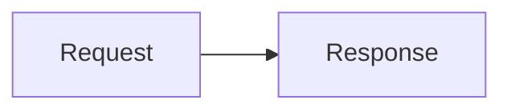

# Markdown-to-LaTeX book template

This repository turns an ordered set of Markdown chapters into a PDF and a
self-contained LaTeX source archive. It is deliberately opinionated: content
is untrusted, raw HTML and raw TeX are disabled, and inexpensive content checks
run before the comparatively slow TeX build.

## Who edits what

**Authors normally edit only `notes/**/*.md` and `book.yml`.** Images referenced
by a chapter belong in `notes/assets/`. Maintainers own `scripts/`, `filters/`,
`.github/workflows/`, `schema/`, and `templates/`; changes there alter the build
or its trust boundary and should receive maintainer review.

## Prerequisites

For validation, install Python 3.11+ and the pinned packages:

```sh
python -m pip install -r requirements.txt
```

For a complete local build, also install:

* Pandoc 3.1 or newer;
* TeX Live 2023+ with XeLaTeX, `latexmk`, and the `collection-latexextra`,
  `collection-fontsrecommended`, and `collection-langenglish` collections;
* Node.js 20+ and Mermaid CLI (`npm install` installs the pinned version); and
* the fonts selected in `book.yml` (the defaults use TeX Gyre fonts).

## Repository layout

| Path | Purpose | Owner |
|---|---|---|
| `book.yml` | Book metadata and ordered chapter list | Authors |
| `notes/**/*.md` | Chapter source | Authors |
| `notes/assets/` | Checked-in image sources | Authors |
| `schema/book.schema.json` | Configuration contract | Maintainers |
| `scripts/` | Validation and reproducible build entry points | Maintainers |
| `filters/` | Pandoc transformations (including Mermaid) | Maintainers |
| `templates/` | LaTeX template and package policy | Maintainers |
| `build/`, `dist/` | Generated, ignored output | Generated |

## Start or edit a book

### Chapter names and order

Use lower-case, zero-padded numeric prefixes, for example
`notes/01-getting-started.md`, `notes/02-long-example.md`, and nested names such
as `notes/03-api/01-overview.md`. The number makes file browsing predictable;
**the `chapters` array in `book.yml` is the sole source of publication order**.
Every Markdown file under `notes/` must occur there exactly once. Each chapter
must contain non-comment text and exactly one level-one heading.

### Supported Markdown

The build supports Pandoc Markdown headings, emphasis, strong text, ordered and
unordered lists, block quotes, fenced code (with optional language), pipe and
grid tables, links, cross-document links, footnotes, citations if a bibliography
is configured, and images. The example chapters exercise the main forms.

Internal links use a heading fragment (`[Tables](#tables)`) or a repository
chapter path plus fragment (`[diagrams](02-layout-and-diagrams.md#diagrams)`).
Fragments are Pandoc-style slugs. Reference links must have a matching
definition; footnote uses (`[^note]`) must have a matching footnote definition.

### Images and figure labels

Keep image files under `notes/assets/` and use paths relative to the chapter,
such as:

```markdown
{#fig:pipeline width=80%}
```

Every local image must exist, every file under `notes/assets/` must be used, and
explicit identifiers must be unique across the book. SVG, PNG, JPG/JPEG, and PDF
are accepted. Do not use absolute paths or paths that escape `notes/`.

### Tables

Use pipe tables for normal data. Pandoc emits LaTeX `longtable`, so tables may
flow onto later pages and repeat their headers. Keep cells concise, avoid manual
HTML, and prefer splitting a very wide table. The example's inventory table is
long enough to demonstrate a page break. A caption goes immediately below:

```markdown
| Name | Meaning |
|---|---|
| `id` | Stable identifier |

: Fields exported by the service. {#tbl:fields}
```

### Mermaid diagrams

Use a fenced block with class `mermaid` and a globally unique identifier:

````markdown
```{.mermaid #fig:flow caption="Build flow"}
flowchart LR
  Markdown --> Pandoc --> PDF
```
````

The build renders it to SVG with the pinned Mermaid CLI before Pandoc runs.
Validation checks identifiers, but Mermaid CLI is the authority on supported
syntax. Avoid experimental diagram types and remote icons.

### Configuration (`book.yml`)

| Field | Required | Description |
|---|---:|---|
| `title`, `author`, `language` | yes | PDF metadata; `language` is a BCP-47-style tag. |
| `chapters` | yes | Non-empty, unique list of Markdown paths below `notes/`. |
| `subtitle`, `date` | no | Optional title-page strings. |
| `mainfont`, `sansfont`, `monofont` | no | Locally installed font names passed to XeLaTeX. |
| `papersize` | no | `a4` or `letter` (default `a4`). |
| `toc_depth` | no | Table-of-contents depth from 1 through 5. |
| `bibliography` | no | Existing `.bib` file below `notes/`. |

The JSON Schema in `schema/book.schema.json` is definitive. Unknown fields are
rejected so spelling mistakes cannot silently alter a build.

## Validate and build locally

```sh
python scripts/validate.py
npm install
./scripts/build.sh
```

The first command performs schema/YAML checks, chapter checks, missing and
orphaned asset detection, duplicate figure-label detection, internal-link and
fragment checks, and Markdown reference/footnote checks. `build.sh` repeats
validation, renders Mermaid, writes `dist/book.pdf`, and creates
`dist/book-latex-source.tar.gz`.

Generated work lives in `build/`; delete it and `dist/` for a clean rebuild.

## CI and artifacts

On every pull request and every push, the **validate** job runs first. The full
**build** job runs only after validation succeeds. Pushes to `main` and manual
`workflow_dispatch` runs upload both artifacts; pull requests build the PDF but
do not publish artifacts. In GitHub, open the workflow run, scroll to
**Artifacts**, and download `book-pdf` or `book-latex-source`.

`book-latex-source.tar.gz` contains `main.tex`, all generated Mermaid SVGs, and
all other images needed by TeX. It intentionally needs neither this repository,
Pandoc, Node, nor Python. Reproduce the PDF exactly from the extracted archive:

```sh
tar -xzf book-latex-source.tar.gz
cd book-latex-source
SOURCE_DATE_EPOCH=0 latexmk -xelatex -interaction=nonstopmode -halt-on-error main.tex
```

Use the same TeX Live release and fonts as CI for byte-for-byte consistency.

## Raw HTML and raw LaTeX trust model

Raw HTML and raw LaTeX are **disabled by default** using Pandoc's
`markdown-raw_html-raw_tex` input format. HTML tags remain literal text or are
rejected by validation, and raw TeX commands are rejected. This allows normal
repository contributors to propose Markdown without acquiring arbitrary TeX
execution. Escaping via `\input`, `\include`, `\write18`, `\usepackage`, or raw
attribute formats is also rejected. Only maintainers may change this policy in
the build scripts/templates after security review; CI never enables shell escape.

## Troubleshooting

* **Missing fonts:** install the named font or change `mainfont`, `sansfont`, and
  `monofont` to installed names. `fc-list` shows Fontconfig's inventory. Match
  the CI image/TeX Live version when comparing output.
* **Oversized tables:** shorten cells, reduce columns, or split one wide table
  into several. Multipage height is handled by `longtable`; width is not. Avoid
  `\resizebox`, because raw TeX is intentionally blocked.
* **Unsupported Mermaid syntax:** run `npx mmdc -i diagram.mmd -o diagram.svg`
  with this repository's pinned package version. Simplify experimental syntax and inspect the
  generated `.mmd` in `build/mermaid/`.
* **Missing images:** paths are case-sensitive in Linux CI and relative to the
  chapter file. Run validation and move the file below `notes/assets/`.
* **LaTeX errors:** inspect the first error in `build/book-latex-source/main.log`, not the
  final cascade. Re-run the printed `pandoc` or `latexmk` command after cleaning.
* **Local and CI differ:** compare Pandoc, Mermaid CLI, TeX Live, locale, and
  installed font versions. Build in the same container/toolchain as CI and do
  not rely on untracked assets or case-insensitive paths.
# LaTeX book template

A safe, configuration-driven Pandoc template for producing a book from Markdown.
All user-facing settings—including chapter order, typography, page layout, cover,
and front matter—live in the documented [`book.yml`](book.yml). The JSON Schema
rejects unknown settings and unsafe raw LaTeX or command-like configuration.

## Setup and use

Install Python dependencies and ensure `pandoc` and `xelatex` are available:

```sh
python3 -m pip install -r requirements.txt
make validate       # fast validation, before Pandoc or TeX starts
make                # writes build/book.pdf
```

Validation reports the property and reason for malformed dimensions, unsupported
paper sizes, invalid colors, and missing or inaccessible chapter/cover files.
Chapter and asset paths are confined to the directory containing `book.yml`.

The build script passes a temporary JSON metadata file to Pandoc and supplies
chapter paths as argument-list elements (never through a shell). Free-form text is
LaTeX-escaped; values used structurally are schema allowlists. Consequently,
configuration cannot add commands, document classes, or raw template fragments.
This template turns one or more Markdown chapters into a book while handling
the parts of Pandoc publishing that commonly become fragile: chapter-relative
images, Mermaid diagrams, wide/page-breaking tables, and safe LaTeX text.

## Build

Install Pandoc, XeLaTeX, Node.js, and `pdftotext`, then run:

```sh
make
python3 scripts/verify-build.py
```

`npm install` installs the exact (non-range) Mermaid CLI version recorded in
`package.json`. The build never invokes a shell with content-derived
arguments. Generated and copied files live only under `build/assets`; copied
asset names include a hash of their canonical source path so equal basenames
from different chapters cannot collide.

## Figures

Paths are relative to each chapter, including paths containing spaces:

```markdown
{#fig:example width=60% height=8cm align=left}
```

`width`, `height`, `align` (`left`, `center`, or `right`), a caption, and a
label are optional. Figures default to centered and are always rendered with
`keepaspectratio`; default bounds are `\linewidth` by `0.85\textheight`.
Missing files produce an obvious typeset placeholder and warning. Pass
`--strict` directly to `prepare-content.py` when a missing image must fail the
build.

Mermaid fences accept the same presentation attributes; their caption is an
explicit `caption` attribute:

````markdown

````

## Tables

Pandoc emits LaTeX `longtable` output, including repeated headings, captions,
and labels. The Lua filter normalizes explicit column widths and reduces cell
padding/font size for tables with six or more columns without wrapping the
table in an unbreakable resize box. Put exceptionally wide material in a
`{.landscape}` fenced div.
