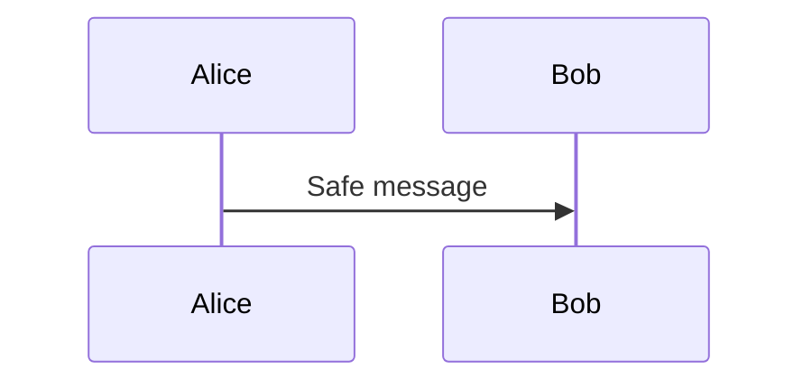

# Content processing fixtures

The nested image, whose filename contains spaces, follows.

{#fig:nested width=55% align=left}

Figure \ref{fig:nested} is referenced after its definition.

{#fig:missing align=right}

```mermaid {#fig:first-flow caption="First Mermaid flow" align=center width=80%}
flowchart LR
  A[Start] --> B[Finish]
```

Text between diagrams establishes their ordering.



| Name | Description |
|:-----|:------------|
| Alpha | A cell whose content spans<br>more than one visual line. |
| Beta | Another multiline<br>table cell. |

: Multiline table caption {#tbl:multiline}

| One | Two | Three | Four | Five | Six | Seven | Eight |
|---:|---:|---:|---:|---:|---:|---:|---:|
| 1000 | 2000 | 3000 | 4000 | 5000 | 6000 | 7000 | 8000 |

: Wide table caption {#tbl:wide}

::: {.landscape}
## Landscape content

This section exercises explicitly landscape-oriented wide content.
:::
