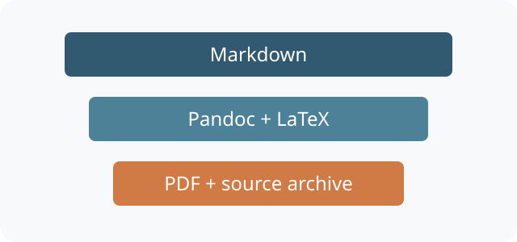

# Layout and diagrams

This chapter combines a static figure with generated diagrams. Figure labels
are globally unique, including labels assigned to Mermaid blocks.

## Images

{#fig:layers width=72%}

Paths are relative to this file. See the [image rules](../README.md#images).

## Diagrams

```mermaid {#fig:build-flow caption="The validated publishing flow" align=center width=85%}
flowchart LR
  A[Markdown chapters] --> B[Validate]
  B --> C[Prepare content]
  C --> D[Pandoc]
  D --> E[LaTeX]
  E --> F[PDF]
```

Sequence diagrams are supported by the pinned renderer too:

```mermaid {#fig:review-flow caption="Author and CI review sequence" align=center width=85%}
sequenceDiagram
  participant Author
  participant CI
  Author->>CI: Push chapters
  CI->>CI: Validate content
  CI-->>Author: PDF artifact
```

The [component inventory](03-reference-tables.md#component-inventory) explains
what each build stage produces.
